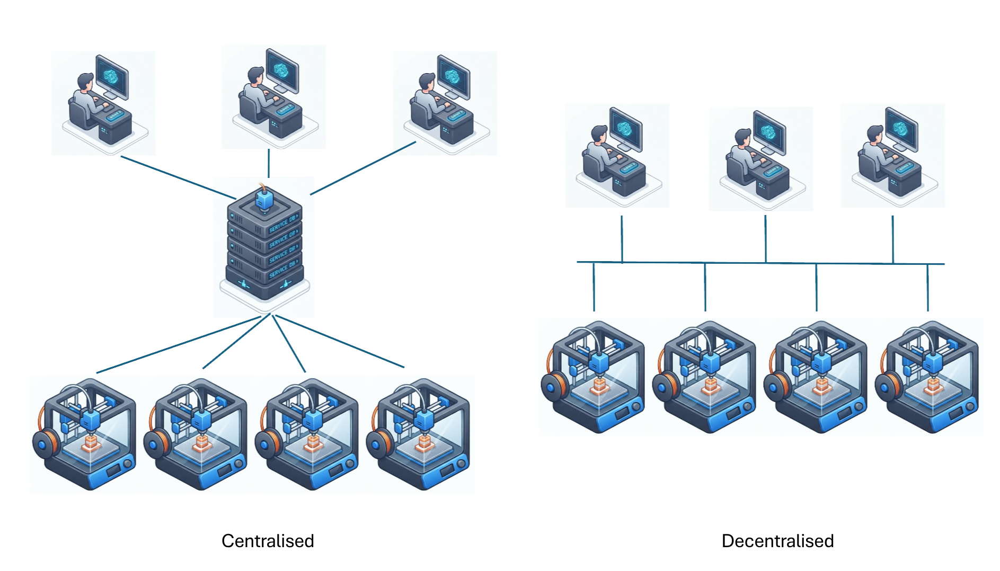

# Introduction

Welcome to the **derusting** book. Derusting is a **de**centralised t**rust**ed manufactu**ring** system demonstrator written in **Rust**, research and industry platform implemented on top of the Prusa Buddy Firmware turning any of their Additive Manufacturing machines into an decntralised agent that can join seek each other out and form their own manufacturing collectives on local networks. The objective is to showcase how resilient decentralised production systems can be built from the very machines that manufacture the products!

This book takes you through the journey of how we've taken our research and implemented on Prusa's Additive Manufacturing machines. Machines that we are using in our labs to study decentralises trusted production system architectures and production agent intelligence.

## Why Decentralised?

Almost, if not all, of today's manufacturing systems appropriate through some level of centralised control. For Additive Manufacturing farms and supply chains, user's `.gcode` is sent to a central repository (possibly owned by a third party) for processing and distribution to the available printers on the network.

First and foremost, they can be seen as a single-point of failure for the entire manufacturing system. If the central server goes down then none of the machines can receive their jobs. May also use global scheduling optimisers that distribute the work to the machines. That is all well and good if you own all your machines but not when you might want to become a consortium of machines owned by lots of different companies with their own constraints.

A de-centralised empowers each and every machine on the network to be their own independent issuer and sharer of jobs through the network. Any machine could accept a job, which can then be shared through peer-to-peer communications with their machine 'friends'. The machines share a job ledger which they can select jobs from.

Decentralised systems provide unprecendented freedom in how one might configure and operate their machines on the network. The system is inherently robust and resilient to disruption with machines able to connect and disconnect as they please with the remaining machines able to re-distributed and re-organise in real-time.

And I think it is cooler. :D.

## Why Trust?

I eluded to it ealier but one of the main concerns of my industry partners has been in submitting their `.gcode` - their Design Intellectual Property (IP) - to a third party. `.gcode` is plaintext ascii making it both machine and human-readable. While many will implement TLS for encrypted transfer, the file itself remains plaintext and you have no control over what they may do with the file once it is on their service. The advent of Artificial Intelligence and Machine Learning is also making industry even more careful with their Design IP.

Our de-centralised research has been putting trust at the forefront of the systems we build. Machines on our de-centralised networks feature their own digital wallets containing hardware unique private and public key pairs. We can use this to individually identify machines on the network and using Web3.0 technologies (Verifiable Credentials and Zero-Knowledge Proofs) to build trust between members (machines and users) in the network. Through these mechanisms you can ensure that your encrypted gcode (yes, we encrypt the gcode from the off) can only be decoded by the machine(s) it is intended for. Blockchain technology can be used for smart contracts and our single-source-of-truth that can be interrogated if a break in trust occurs.

Our derusting getting started demonstrator doesn't go as far to implement all this technology (yet) but please reach out to us if you want to learn more and see the platforms we're building that do include it.

## Why Manufacturing?

I have always been fascinated about how we produce products through our global supply chains. They have a profound impact on both the globale climate crisis and economy. De-centralised services could provide a game-changing capability to how we supply the globe from every day trinkets to spare parts on-demand for cars, be resilient to disruption and rapdily respond to crisis events such as COVID.

## Why Rust?

Rust is a modern system's programming language known for its memory safety and zero-cost abstraction performance guarantees. It has been adopted into the Linux Kernel alongside C and is increasingly being used by software developers in safety critical systems. The language provides modern build tooling making it a more familiar developer experience for those used to developing using an interpreted language (e.g., Python). It features an integrated build workflow, deterministic builds, package management, language support protocol, test framework, documentation building, and toolchain versioning. And ultimately, I have had a blast coding in it, :smile:.

## Structure of the Book

## Support

Yes, please. We have been fortunate to have received funding in the past from UKRI for our blue-skies research but we're now in the need of funding the translate it into industry practice. And `derusting` is this start of this journey.

If this book and its concepts supports you in anyway then please consider donating to the cause so I can continue:

- to improve and add to the book.
- run livestreams taking you through the book.
- conducting further research to develop the next innovations.

And feel free to reach out to me if you want me to spare some time, come visit, and consult on any of your decentralised manufacturing systems projects.

<iframe src="https://github.com/sponsors/jamesgopsill/card" title="Sponsor jamesgopsill" height="100" width="100%" style="border: 0; color-scheme: light; mix-blend-mode: multiply;"></iframe> 
